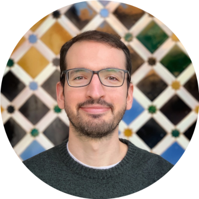

{:style="display:block; margin-left:auto; margin-right:auto"}

_"No hay nada noble en ser superior a tu prójimo; la verdadera nobleza es ser superior a tu yo anterior." ― Ernest Hemingway_{:style="display:block; text-align:center;"}

¡Hola! :grinning: :wave:

Me llamo Fran y soy de Zaragoza :city_sunrise:, aunque el confinamiento me pilló de visita en la terreta valenciana y aquí sigo, varios años después, por cuestiones del corazón :heart:

***

Busco la excelencia creando procesos no solo eficientes [^1] :bullettrain_front: o eficaces [^2] :airplane: sino efectivos [^3] :ship: Mi propósito es transformar los datos :microscope::bar_chart: en información accionable :pill::bulb: que permita llevar vidas más saludables y sostenibles :camping: Para ello, aprovecho la experiencia adquirida en I+D (bioinformática :dna:, biología computacional :microscope::desktop_computer:), ingeniería informática (automatización :robot:, optimización :stopwatch:, [entornos de alto rendimiento](https://es.wikipedia.org/wiki/Computaci%C3%B3n_de_alto_rendimiento) :rocket:) y el análisis de datos :bar_chart: (9+ años de experiencia) mientras perfecciono mis habilidades en arquitectura de software :building_construction:, ciencia e ingeniería de datos :abacus::file_cabinet:, [DevOps](https://es.wikipedia.org/wiki/DevOps) :hammer_and_wrench: y la [computación en la nube](https://es.wikipedia.org/wiki/Computaci%C3%B3n_en_la_nube) :cloud:

Si quieres saber cómo trabajo, consulta [este enlace](https://drive.google.com/file/d/1M6LgQF-HaFR5iNxZfxfsjKip_gwWt0hy/view?usp=sharing), donde encontrarás algunos ejemplos con experiencias laborales pasadas y presentes.

# De dónde vengo y adónde voy :rewind: :fast_forward:

Cuando era pequeño empecé construyendo sets de LEGO en el mundo real y unos años más tarde, durante mi adolescencia, di el salto al mundo digital gracias a la informática de la mano de un [iMac G3](https://es.wikipedia.org/wiki/IMac_G3) (el primer lanzamiento importante de un producto de Apple bajo la dirección de Steve Jobs tras su regreso a la empresa que cofundó) :desktop_computer:

Lo que empezaron siendo aficiones de un niño [^4] y adolescente dieron lugar a una licenciatura en Ingeniería Informática :mortar_board:

Los dos primeros años de mi carrera profesional los dediqué a desarrollar procesos para el análisis masivo de datos genéticos :dna: y la identificación de mutaciones que aumentan la susceptibilidad o predisposición a padecer ciertas enfermedades.

En 2022 defendí [mi tesis doctoral](https://bit.ly/3ZvdCZz) :mortar_board: en Ingeniería Biomédica, centrada en el modelado y la predicción del comportamiento de sistemas biológicos complejos :crystal_ball::microscope: [Durante mi doctorado, implementé una metodología autónoma basada en técnicas de optimización Bayesiana que facilitaba la integración estudios teóricos con datos experimentales](https://bit.ly/3YWEfpp). Dicha integración es clave si queremos seguir desentrañando los misterios de la vida y el universo (:four::two:). Además, [esta metodología me permitió automatizar el proceso de calibrado de los modelos computacionales que estaba desarrollando en base a datos experimentales recopilados por mis colegas del laboratorio de mecanobiología](https://bit.ly/3UHVPuY) :desktop_computer::arrows_counterclockwise::microscope:

En 2023 inicié mi transición a la industria de la mano de [Caphunters](https://caphunters.es/) :billed_cap:, una empresa del sector retail interesada en predecir la demanda futura de sus productos :crystal_ball::chart_with_upwards_trend: En este proyecto pude perfeccionar mis habilidades en el análisis de series temporales utilizando modelos estadísticos y basados en inteligencia artificial.

Actualmente estoy continuando mi formación en ingeniería de datos ([PostgreSQL](https://www.postgresql.org/) :file_cabinet:), DevOps (sistemas y entornos contenedorizados [[Docker](https://www.docker.com/) :whale2:], infraestructura como código [[Terraform](https://www.terraform.io/) :artificial_satellite:]) y computación en la nube ([Google Cloud Platform](https://cloud.google.com/)) :cloud:

> :sassy_man: Si quieres comprobar mis progresos en este nuevo aprendizaje, puedes consultar [mi repositorio público de GitHub](https://bit.ly/3Y5erHr).

# Sobre mí :man_scientist: :man_technologist:

Probablemente el hecho de que mis padres, mi hermana pequeña y mi pareja sean médicos :stethoscope: favoreciese mi predisposición a estudiar los procesos y sistemas relacionados con la vida durante ocho años. Que mi abuelo materno y sus tres hijos (tíos míos) sean ingenieros agrónomos :man_farmer: también debió tener algo que ver :stuck_out_tongue:

Mantengo un enfoque basado en el aprendizaje :open_book::memo::man_scientist: y la mejora continua :repeat::chart_with_upwards_trend::rocket:

> :sassy_man: Si quieres comprobar cómo pasé de no saber absolutamente nada sobre genética, análisis masivo de datos y métodos de alineamiento de secuencias a publicar un artículo sobre estos temas, puedes consultar [esta comunicación](https://bit.ly/3TEFkPV).

> :sassy_man: Si quieres confirmar cómo pasé de no saber absolutamente nada sobre biomecánica, biología celular, entornos de alto rendimiento y métodos de optimización Bayesiana a defender una tesis doctoral sobre esas cuestiones, puedes consultar [este documento](https://bit.ly/3ZvdCZz).

> :sassy_man: Si quieres constatar cómo pasé de no saber absolutamente nada sobre el análisis de secuencias temporales a colaborar en el desarrollo de Darts, una de las librerías open source más utilizadas para predicción y detección de anomalías en series temporales, puedes consultar [este enlace](https://bit.ly/4dd3HuU).

Me gusta trabajar con personas, cada una con una historia y experiencia únicas :bust_in_silhouette: De todas puedo aprender algo (o muchas cosas) :100:

> :sassy_man: A lo largo de mi carrera profesional, he disfrutado colaborando con personas con historias y experiencias únicas como [Elvira Mayordomo](http://webdiis.unizar.es/~elvira/), [Jorge Álvarez Jarreta](https://www.linkedin.com/in/jorge-%C3%A1lvarez-jarreta-95a6162a/), [José Manuel García Aznar](https://m2be.unizar.es/people/jmgaraz/), [Mª José Gómez Benito](https://m2be.unizar.es/people/mjose-gomez-benito/), [Fabian Spill](https://www.linkedin.com/in/fabian-spill-37504250/), [Cristina del Amo](https://www.linkedin.com/in/cristinadelamomateos/), [Ismael González Valverde](https://www.linkedin.com/in/ismael-gonzalez-valverde/), [Gabriele Nasello](https://www.linkedin.com/in/gnasello), [Silvia Hervás Raluy](https://www.linkedin.com/in/silviahervasraluy/), [Diego Saínz de Mena](https://www.linkedin.com/in/diego-sainz-de-mena), [Inês Gonçalves](https://www.linkedin.com/in/inesggoncalves/), [Eduardo Sánchez Burillo](https://www.linkedin.com/in/eduardo-s%C3%A1nchez-burillo-2638b8194/), [Javier Briz](https://www.linkedin.com/in/javier-briz-3a7a0a23/) y [Rafael Redrado](https://www.linkedin.com/in/rafaelredrado), entre muchos otros. Todos me regalaron grandes aprendizajes :orange_heart:

Valoro muy positivamente trabajar en equipo :busts_in_silhouette:, colaborando :handshake: y aprendiendo de mis compañeros con el objetivo de lograr metas comunes :dart:

> :sassy_man: Sirva como ejemplo de mi aprecio por el trabajo en equipo y la colaboración con compañeros con experiencias y habilidades complementarias dos de los proyectos de investigación que desarrollé durante mi doctorado:
> 1. [Publicación sobre una metodología para automatizar la integración de modelos computacionales con datos experimentales](https://bit.ly/3ZC66w7).
> 2. [Publicación sobre los actores involucrados en el proceso de migración celular](https://bit.ly/3zww1KQ).

He disfrutado tanto en el rol de mentor :man_teacher: como en el aprendiz :man_student:

> :sassy_man: Sirvan como ejemplo de mi experiencia como mentor los Trabajos Fin de Grado de [Alejandro Modrego](https://bit.ly/4eAGmnV) y [Benjamín Real Ruiz](https://bit.ly/4eh4b4j) que co-dirigí durante mi doctorado.

> :sassy_man: Sirva como muestra de mi experiencia como aprendiz y mi capacidad para convertirme en experto en una materia (en este caso, el modelado y la predicción del comportamiento de sistemas biológicos complejos) [mi tesis doctoral](https://bit.ly/3ZvdCZz).

Intento tener siempre presente los objetivos estratégicos :chart_with_upwards_trend: sin que ello penalice la atención al detalle :mag:

> :sassy_man: Sirva como ejemplo de mi visión estratégica mi colaboración con:
> 1. Socios industriales como [SigOpt](https://sigopt.org/) (plataforma de optimización de modelos basados en inteligencia artificial a escala, [adquirida en 2020 por Intel](https://www.intel.com/content/www/us/en/newsroom/news/sigopt-to-scale-ai-productivity-performance.html)).
> 2. Compañeros del mundo académico como [Rubén Martínez Cantín](https://webdiis.unizar.es/~rmcantin/index.php) (experto en aprendizaje automático y optimización Bayesiana) y [Yago Juste Lanas](https://www.linkedin.com/in/yagojustelanas/) (biotecnólogo e investigador con amplia experiencia en el laboratorio de mecanobiología).
> 
> Uno de los resultados de de dicha colaboración fue [esta publicación conjunta](https://bit.ly/3ZC66w7).

> :sassy_man: Sirva como ejemplo de mi atención al detalle [este informe reportando un bug](https://bit.ly/4eQwgiS) :bug: en el repositorio oficial de la librería open source [Darts](https://unit8co.github.io/darts/) para la predicción y detección de anomalías en series temporales. Bug que yo mismo resolví en [este pull request](https://bit.ly/4dd3HuU).

Para cumplir estos propósitos, me esfuerzo por producir código limpio :sponge: y sencillo :beginner:, y por documentar :pencil: no solo el código sino también los procesos y objetivos.

> :sassy_man: Sirva como ejemplo de mis esfuerzos por producir código limpio y sencillo [este módulo Python para la gestión de datos relativos a los viajes (mensuales) de los taxis amarillos de NYC y su ingesta en un servidor PostgreSQL](https://bit.ly/3N7fBMd).

> :sassy_man: Sirvan como ejemplo de mis esfuerzos por documentar no solo el código los siguientes informes:
> 1. [Cómo contenedorizar y segurizar un servidor PostgreSQL y pgAdmin](https://bit.ly/3N6ofKU).
> 2. [Cómo utilizar infraestructura como código en Google Cloud Platform](https://bit.ly/4eHnXWA).

Como una persona con una mentalidad de crecimiento, busco oportunidades para seguir formándome :writing_hand:, aprender nuevas técnicas :construction_worker_man:, ganar experiencia en el uso de nuevas tecnologías :hammer_and_wrench: y desarrollar e implementar buenas prácticas :nerd_face:

***

En lo personal, me esfuerzo por mantener una mente sana en un cuerpo sano. Para ello, sigo una dieta a base de [lecturas](https://bit.ly/3N5FOuq) :books: y pódcasts :studio_microphone: variados, meditación :lotus_position_man:, y entrenamiento de cardio :running_man: :swimming_man: y fuerza :weight_lifting_man:

Disfruto descubriendo nuevos lugares :national_park::cityscape: y culturas :japanese_ogre: :european_castle: con mi familia (la original y la elegida :heart:). Recuerdo con gran cariño los viajes por Europa :fr::belgium::it::de::scotland::norway: durante las vacaciones de verano con mi familia, muchos de ellos en coche :minibus: Confieso mantener una relación especial con los [Royal Parks de Londres](https://www.royalparks.org.uk/) [^5] :deer::deciduous_tree: y Nueva York :taxi::statue_of_liberty: [^6] Ya he empezado a planificar un viaje a Corea del Sur :kr: y Japón :jp::shinto_shrine:, y tengo muchos otros todavía pendientes.

Mi pasión por aprender de (casi) cualquier cosa también se extiende al ámbito personal:

1. De pequeño acompañaba con frecuencia a mi abuelo materno a una finca de nogales que tenía en un pequeño municipio dentro del conocido [triángulo de hielo o del frío](https://www.eltiempo.es/noticias/el-triangulo-del-frio-esta-en-espana-lo-conoces). Es por él y por mis tíos, los tres ingenieros agrónomos como su padre, que también me interesa la agricultura :seedling::ear_of_rice: Ya no recojo nueces en [Daroca](http://www.daroca.es/turismo/), pero en 2023 instauré la tradición anual de ir a recoger olivas en la finca de olivos :olive: que tienen los padres de una amiga en [Ontinyent](https://turisme.ontinyent.es/ontinyent/web_php/index.php).
2. Con ayuda de mi suegro y un amigo particularmente habilidoso, aspiro a convertirme en un manitas dentro y fuera del hogar :toolbox: Entre otras cosas, he arreglado un secador de pelo y un termo eléctrico de agua caliente al que se le había estropeado el termostato :thermometer: También he alicatado las paredes del baño :bathtub: de mi casa y cambiado el suelo del salón :couch_and_lamp: de casa de mis padres justo a tiempo para celebrar la navidad :christmas_tree:

Si quieres saber más sobre mí, no dudes en [ponerte en contacto conmigo](mailto:francisco.merinocasallo+githubio@gmail.com?subject=[GitHub%20Page]%20¡Hola!) :mailbox_with_mail:

***
***

[^1]: Los procesos eficientes se centran en **cómo** hacer el trabajo y, por tanto, son aquellos que hacen un uso de los recursos óptimo.
[^2]: Los procesos eficaces se centran en **qué** cosas se hacen y, por tanto, son aquellos que hacen el trabajo deseado.
[^3]: Los procesos efectivos se centran en **cómo** hacer el trabajo y en **qué** cosas se hacen y, por lo tanto, hacen el trabajo deseado haciendo un uso de los recursos óptimo.
[^4]: No he dejado de montar sets de LEGO siendo adulto :shushing_face:
[^5]: Fue en [Bushy Park](https://www.royalparks.org.uk/visit/parks/bushy-park) donde le pedí matrimonio :kneeling_man::ring: a mi pareja.
[^6]: Fue durante un paseo por [Central Park](https://www.centralparknyc.org/) donde me picó el gusanillo del [pajareo](https://es.wikipedia.org/wiki/Observaci%C3%B3n_de_aves) :bird::telescope: